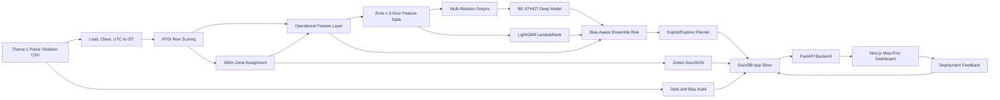
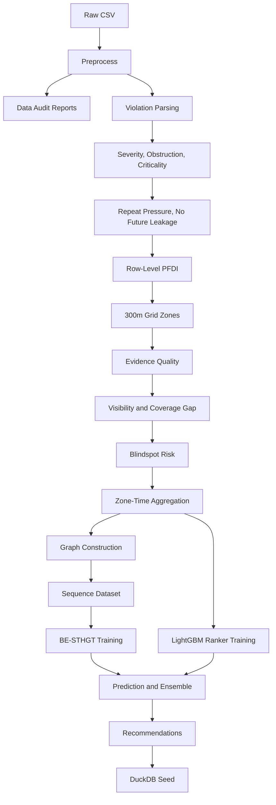
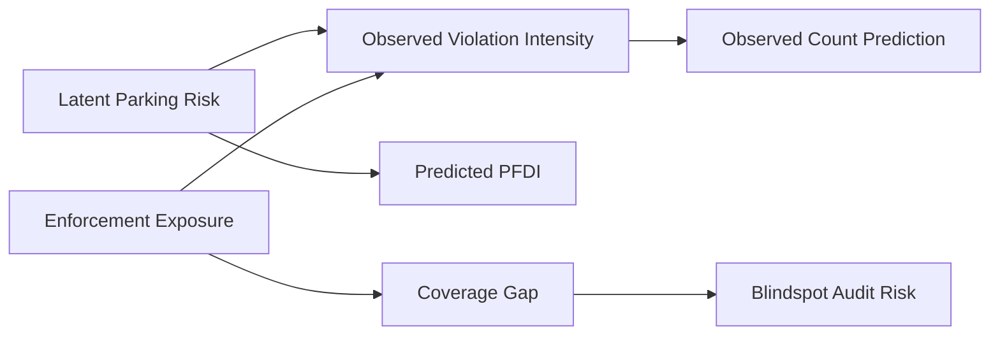
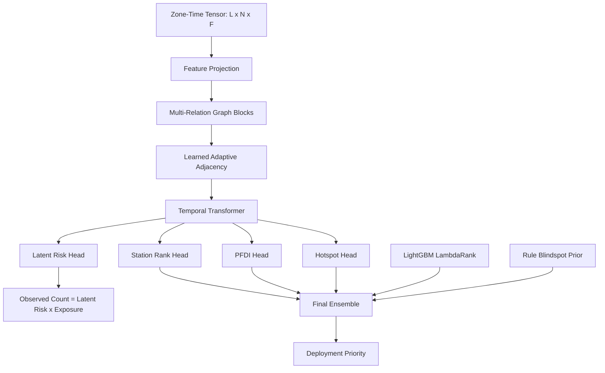
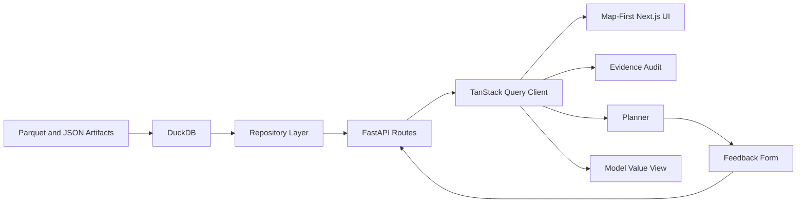

# CurbFlow AI

CurbFlow AI is a full-stack, bias-aware parking enforcement intelligence system for the hackathon theme **Poor Visibility on Parking-Induced Congestion**.

The core idea is direct:

```text
CurbFlow does not confuse no challan with no problem.
```

Police violation records show where enforcement was visible. They do not prove where illegal parking never happened. CurbFlow separates observed parking-risk signals from enforcement-visibility bias, exposes blind spots, and recommends where limited enforcement resources should go next.

## What This Project Solves

Most parking dashboards stop at a heatmap of recorded violations. CurbFlow is designed for operational planning:

- Identify observed illegal-parking hotspots.
- Detect enforcement visibility gaps.
- Flag evidence-poor evening blind spots.
- Estimate a Parking-Induced Flow Disruption Index, PFDI.
- Build station-wise patrol intelligence and resource recommendations.
- Preserve dataset caveats instead of turning missing evidence into false certainty.

## Dataset

CurbFlow uses only the Theme 1 police parking violation CSV.

```text
Expected raw path:
curbflow-ai/data/raw/police_parking_violations_nov2023_apr2024.csv

Observed row count:
about 298,450 rows

Actual date range:
November 2023 to April 2024
```

Dataset rules:

- `created_datetime` is parsed as UTC and converted to `Asia/Kolkata`.
- `closed_datetime`, `action_taken_timestamp`, and `description` are fully null or audit-only and are not labels.
- `validation_status` null values are treated as unknown confidence, not rejected evidence.
- Evening records are sparse, so evening zero-violation windows are treated as low evidence, not safe zones.
- Repeat-vehicle pressure uses only previous chronological history.
- Train, validation, and test splits are chronological.
- ASTraM and external datasets are not used for Theme 1.

## System Architecture



## Data Pipeline



## Bias-Aware Modeling Concept

CurbFlow explicitly separates true obstruction risk from enforcement visibility.



The deep model uses the exposure relationship:

```text
observed_mu = latent_risk * exposure
```

This prevents the model from treating low-enforcement evening windows as proof that illegal parking risk is low.

## Model Stack



The model stack includes:

- **BE-STHGT:** Bias-Exposure Spatio-Temporal Heterogeneous Graph Transformer.
- **LightGBM LambdaRank:** station-window ranking over engineered features.
- **Rule blindspot prior:** explicit support for low-visibility audit windows.
- **Optional benchmark script:** LightGBM, CatBoost, and XGBoost comparison training through `scripts/run_model_benchmark.py`.

## Operational Intelligence Layers

```mermaid
flowchart TD
    ROOT[CurbFlow Intelligence] --> HOT[Observed Hotspots]
    ROOT --> VIS[Enforcement Visibility]
    ROOT --> BLIND[Blindspots]
    ROOT --> PATROL[Patrol Digital Twin]
    ROOT --> SPACE[Spatial Context]
    ROOT --> PLAN[Planner]

    HOT --> HOT1[PFDI]
    HOT --> HOT2[Violation Severity]
    HOT --> HOT3[Repeat Pressure]
    HOT --> HOT4[Vehicle Obstruction]

    VIS --> VIS1[Device Activity]
    VIS --> VIS2[User Activity]
    VIS --> VIS3[Station-Hour Activity]
    VIS --> VIS4[Patrol Route Coverage]
    VIS --> VIS5[Validation Coverage]

    BLIND --> BLIND1[Static Potential]
    BLIND --> BLIND2[Coverage Gap]
    BLIND --> BLIND3[Evening Prior]
    BLIND --> BLIND4[Uncertainty]

    PATROL --> PATROL1[Patrol Myopia]
    PATROL --> PATROL2[Transition Graph]
    PATROL --> PATROL3[Route Expansion Opportunities]

    SPACE --> SPACE1[Hidden Junction Basins]
    SPACE --> SPACE2[Road Corridors]
    SPACE --> SPACE3[Place-Type Flags]

    PLAN --> PLAN1[Exploit Known Hotspots]
    PLAN --> PLAN2[Explore Blindspots]
    PLAN --> PLAN3[Officer Constraints]
    PLAN --> PLAN4[Towing Constraints]
```



## Application Architecture



Frontend stack:

- Next.js App Router
- TypeScript
- Tailwind CSS
- shadcn/ui primitives
- MapLibre-compatible map experience
- Recharts
- TanStack Query
- Zustand

Backend stack:

- Python
- FastAPI
- DuckDB
- Parquet
- PyTorch
- LightGBM
- CatBoost and XGBoost for optional benchmarks

## Repository Layout

```text
requirements.txt                 Single Python dependency file
curbflow-ai/
  configs/                       Data, scoring, feature, graph, model, planner configs
  data/                          Local raw, interim, processed, and app data
  artifacts/                     Local model, metric, and report outputs
  scripts/                       Runnable pipeline entrypoints
  src/curbflow/                  Core Python package
  apps/api/                      FastAPI backend
  apps/web/                      Next.js frontend
  docs/                          Architecture, demo, and judge-facing notes
  tests/                         Unit and integration tests
```

Generated data, raw CSV files, model binaries, DuckDB files, frontend builds, and local environment files are ignored by git.

## Fresh Clone Setup

From a fresh clone:

```bash
cd GridLock_Mind-Mesh
python -m pip install -r requirements.txt
cd curbflow-ai
```

Place the Theme 1 CSV at:

```text
curbflow-ai/data/raw/police_parking_violations_nov2023_apr2024.csv
```

Run a dashboard-ready fast pipeline:

```bash
python scripts/run_full_pipeline.py --fast-demo --skip-deep
python scripts/seed_demo_db.py --rebuild
```

Run the API:

```bash
python -m uvicorn apps.api.main:app --host 127.0.0.1 --port 8000
```

Run the frontend:

```bash
cd apps/web
npm install
NEXT_PUBLIC_API_BASE_URL=http://127.0.0.1:8000 npm run dev -- --port 3000
```

## Makefile Commands

Run from `curbflow-ai/`:

```bash
make setup
make audit
make preprocess
make pfdi
make zones
make features
make graph
make train-deep
make train-ranker
make predict
make recommend
make db
make api
make web
make test
```

The complete pipeline:

```bash
make full
```

The lightweight CI-style check:

```bash
make ci
```

## Full Model Training

Run the feature pipeline before training:

```bash
python scripts/run_full_pipeline.py --skip-deep --skip-ranker
```

Train BE-STHGT:

```bash
python scripts/run_train_deep.py --device cuda --epochs 80 --batch-size 8
```

Train the LightGBM ranker:

```bash
python scripts/run_train_ranker.py
```

Generate predictions and recommendations:

```bash
python scripts/run_predict.py
python scripts/run_recommendations.py
python scripts/seed_demo_db.py --rebuild
```

Train optional benchmark comparison models:

```bash
python scripts/run_model_benchmark.py \
  --models lightgbm,catboost,xgboost \
  --iterations 800 \
  --output artifacts/metrics/model_benchmark_metrics.json
```

After benchmark training, reseed DuckDB:

```bash
python scripts/seed_demo_db.py --rebuild
```

## API Surface

```text
GET  /health
GET  /audit/summary
GET  /audit/hourly
GET  /zones/geojson
GET  /hotspots
GET  /blindspots
GET  /zones/{zone_id}
GET  /patrol/summary
GET  /patrol/routes
GET  /metrics/model
POST /planner/recommend
POST /feedback
```

Privacy rule: the API must not return raw `vehicle_number`, `device_id`, or `created_by_id`.

## Dashboard Pages

```text
/                         Map-first command view
/audit                    Evidence audit and model value
/hotspots                 Observed hotspot map and cards
/blindspots               Evening blindspot audit view
/junction-basins          Hidden junction spillover view
/patrol-digital-twin      Patrol myopia and route coverage
/planner                  Resource-constrained enforcement planner
/metrics                  Redirects into evidence audit model view
```

## Artifact Contract

```text
data/interim/
  violations_clean.parquet
  row_scores.parquet
  zone_assignments.parquet
  graph_edges.parquet

data/processed/
  zones.geojson
  zone_time_features.parquet
  model_training_table.parquet
  deep_predictions.parquet
  predictions.parquet
  recommendations.parquet
  coverage_audit.parquet

data/app/
  curbflow.duckdb

artifacts/models/
  be_sthgt_model.pt
  ranker_lgbm.txt
  model_metadata.json

artifacts/metrics/
  deep_metrics.json
  ranker_metrics.json
  model_benchmark_metrics.json
  model_card.md

artifacts/reports/
  data_quality_report.md
  bias_audit_report.md
  eda_summary.json
```

These artifacts are generated locally and intentionally excluded from git unless explicitly documented.

## Feedback Loop

The historical dataset has no reliable action-outcome labels. CurbFlow adds a feedback table for future learning:

```text
POST /feedback
```

Feedback captures action taken, officers deployed, tow units used, vehicles found, vehicles removed, vehicles towed, road-cleared status, approximate queue length, and notes.

Future learning can be framed as:

```text
future_action_effectiveness = outcome feedback / predicted risk
```

Feedback is stored for future learning and is not used in the current training pipeline.

## Guardrails

CurbFlow is intentionally conservative about what it claims:

- It does not claim exact traffic speed reduction.
- It does not claim measured congestion.
- PFDI is a proxy for parking-induced flow disruption, not measured speed loss.
- No challan does not mean no illegal parking.
- Evening outputs are blindspot audit priorities, not validated evening predictions.
- `validation_status` null values are unknown confidence, not rejection.
- Repeat pressure uses previous vehicle history only.
- Train, validation, and test splits are chronological.
- ASTraM is not used.
- Streamlit is not used.
- Low exposure increases uncertainty and audit priority; it does not fabricate hotspots.
- The system supports operational prioritization, not legal adjudication.

## Current Engineering Notes

- The strongest currently tracked ranking artifact is the LightGBM LambdaRank result over CurbFlow features.
- BE-STHGT is included and trainable, but deep ranking metrics should be presented with caveats unless retrained and benchmarked on the target runtime.
- Optional benchmark values for CatBoost and XGBoost should come from `scripts/run_model_benchmark.py`; they should not be invented in the UI.

## Git Hygiene

The repository ignores:

- raw CSV datasets;
- generated Parquet outputs;
- DuckDB and SQLite files;
- model checkpoints and serialized models;
- local reports and generated metrics;
- `.env` files;
- Python caches;
- `node_modules` and `.next` builds;
- macOS and editor metadata.

Commit source code, configuration, documentation, tests, and lightweight scaffold files only.
