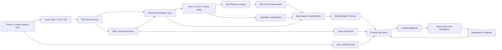
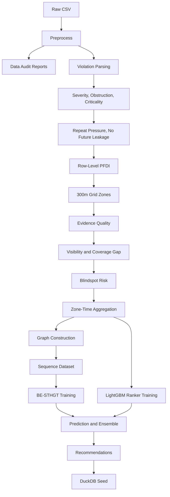
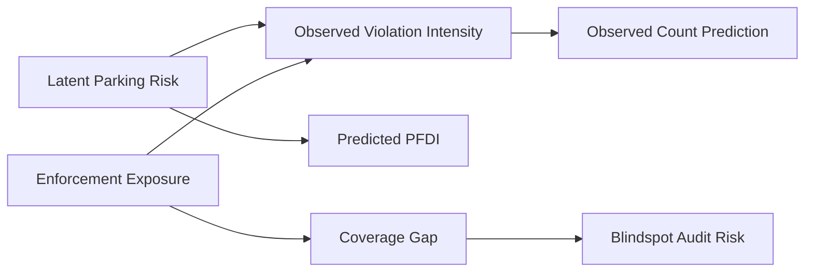
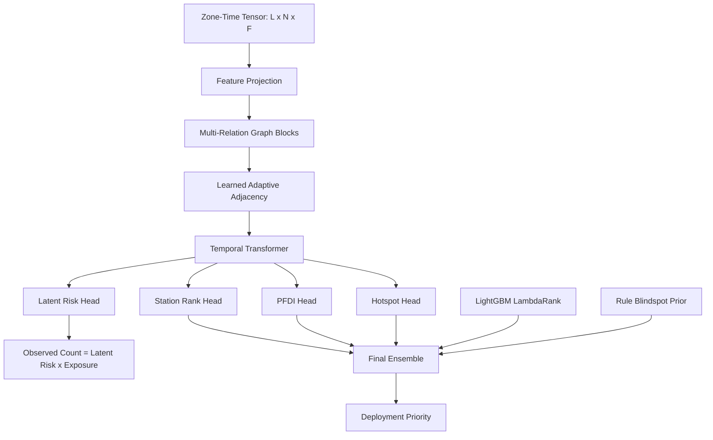
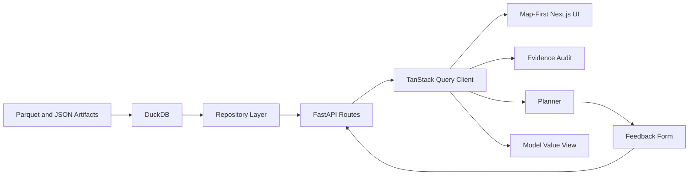

# CurbFlow AI

CurbFlow AI is a full-stack, bias-aware parking enforcement intelligence system for the hackathon theme **Poor Visibility on Parking-Induced Congestion**.

The core idea is direct:

```text
CurbFlow does not confuse no challan with no problem.
```

Police violation records show where enforcement was visible. They do not prove where illegal parking never happened. CurbFlow separates observed parking-risk signals from enforcement-visibility bias, exposes blind spots, and recommends where limited enforcement resources should go next.

## What This Project Solves

Most parking dashboards stop at a heatmap of recorded violations. CurbFlow is designed for operational planning:

- Identify observed illegal-parking hotspots.
- Detect enforcement visibility gaps.
- Flag evidence-poor evening blind spots.
- Estimate a Parking-Induced Flow Disruption Index, PFDI.
- Build station-wise patrol intelligence and resource recommendations.
- Preserve dataset caveats instead of turning missing evidence into false certainty.

## Dataset

CurbFlow uses only the Theme 1 police parking violation CSV.

```text
Expected raw path:
curbflow-ai/data/raw/police_parking_violations_nov2023_apr2024.csv

Observed row count:
about 298,450 rows

Actual date range:
November 2023 to April 2024
```

Dataset rules:

- `created_datetime` is parsed as UTC and converted to `Asia/Kolkata`.
- `closed_datetime`, `action_taken_timestamp`, and `description` are fully null or audit-only and are not labels.
- `validation_status` null values are treated as unknown confidence, not rejected evidence.
- Evening records are sparse, so evening zero-violation windows are treated as low evidence, not safe zones.
- Repeat-vehicle pressure uses only previous chronological history.
- Train, validation, and test splits are chronological.
- ASTraM and external datasets are not used for Theme 1.

## System Architecture



## Data Pipeline



## Bias-Aware Modeling Concept

CurbFlow explicitly separates true obstruction risk from enforcement visibility.



The deep model uses the exposure relationship:

```text
observed_mu = latent_risk * exposure
```

This prevents the model from treating low-enforcement evening windows as proof that illegal parking risk is low.

## Model Stack



The model stack includes:

- **BE-STHGT:** Bias-Exposure Spatio-Temporal Heterogeneous Graph Transformer.
- **LightGBM LambdaRank:** station-window ranking over engineered features.
- **Rule blindspot prior:** explicit support for low-visibility audit windows.
- **Optional benchmark script:** LightGBM, CatBoost, and XGBoost comparison training through `scripts/run_model_benchmark.py`.

## Operational Intelligence Layers

```mermaid
flowchart TD
    ROOT[CurbFlow Intelligence] --> HOT[Observed Hotspots]
    ROOT --> VIS[Enforcement Visibility]
    ROOT --> BLIND[Blindspots]
    ROOT --> PATROL[Patrol Digital Twin]
    ROOT --> SPACE[Spatial Context]
    ROOT --> PLAN[Planner]

    HOT --> HOT1[PFDI]
    HOT --> HOT2[Violation Severity]
    HOT --> HOT3[Repeat Pressure]
    HOT --> HOT4[Vehicle Obstruction]

    VIS --> VIS1[Device Activity]
    VIS --> VIS2[User Activity]
    VIS --> VIS3[Station-Hour Activity]
    VIS --> VIS4[Patrol Route Coverage]
    VIS --> VIS5[Validation Coverage]

    BLIND --> BLIND1[Static Potential]
    BLIND --> BLIND2[Coverage Gap]
    BLIND --> BLIND3[Evening Prior]
    BLIND --> BLIND4[Uncertainty]

    PATROL --> PATROL1[Patrol Myopia]
    PATROL --> PATROL2[Transition Graph]
    PATROL --> PATROL3[Route Expansion Opportunities]

    SPACE --> SPACE1[Hidden Junction Basins]
    SPACE --> SPACE2[Road Corridors]
    SPACE --> SPACE3[Place-Type Flags]

    PLAN --> PLAN1[Exploit Known Hotspots]
    PLAN --> PLAN2[Explore Blindspots]
    PLAN --> PLAN3[Officer Constraints]
    PLAN --> PLAN4[Towing Constraints]
```



## Application Architecture



Frontend stack:

- Next.js App Router
- TypeScript
- Tailwind CSS
- shadcn/ui primitives
- MapLibre-compatible map experience
- Mappls/MapMyIndia Autosuggest for place lookup on the command map
- Recharts
- TanStack Query
- Zustand

Backend stack:

- Python
- FastAPI
- DuckDB
- Parquet
- PyTorch
- LightGBM
- CatBoost and XGBoost for optional benchmarks

## Repository Layout

```text
requirements.txt                 Single Python dependency file
curbflow-ai/
  configs/                       Data, scoring, feature, graph, model, planner configs
  data/                          Local raw, interim, processed, and app data
  artifacts/                     Local model, metric, and report outputs
  scripts/                       Runnable pipeline entrypoints
  src/curbflow/                  Core Python package
  apps/api/                      FastAPI backend
  apps/web/                      Next.js frontend
  docs/                          Architecture, demo, and judge-facing notes
  tests/                         Unit and integration tests
```

Generated data, raw CSV files, model binaries, DuckDB files, frontend builds, and local environment files are ignored by git.

## Fresh Clone Setup

From a fresh clone:

```bash
cd GridLock_Mind-Mesh
python -m pip install -r requirements.txt
cd curbflow-ai
```

Place the Theme 1 CSV at:

```text
curbflow-ai/data/raw/police_parking_violations_nov2023_apr2024.csv
```

Run a dashboard-ready fast pipeline:

```bash
python scripts/run_full_pipeline.py --fast-demo --skip-deep
python scripts/seed_demo_db.py --rebuild
```

Run the API:

```bash
python -m uvicorn apps.api.main:app --host 127.0.0.1 --port 8000
```

Run the frontend:

```bash
cd apps/web
npm install
npm run dev -- --port 3000
```

Frontend API routing is configured through `apps/web/.env.local`. Use
`NEXT_PUBLIC_API_BASE_URL=/api` and `CURBFLOW_API_INTERNAL_URL=<FastAPI backend URL>`.

## Makefile Commands

Run from `curbflow-ai/`:

```bash
make setup
make audit
make preprocess
make pfdi
make zones
make features
make graph
make train-deep
make train-ranker
make predict
make recommend
make db
make api
make web
make test
```

The complete pipeline:

```bash
make full
```

The lightweight CI-style check:

```bash
make ci
```

## Full Model Training

Run the feature pipeline before training:

```bash
python scripts/run_full_pipeline.py --skip-deep --skip-ranker
```

Train BE-STHGT:

```bash
python scripts/run_train_deep.py --device cuda --epochs 80 --batch-size 8
```

Train the LightGBM ranker:

```bash
python scripts/run_train_ranker.py
```

Generate predictions and recommendations:

```bash
python scripts/run_predict.py
python scripts/run_recommendations.py
python scripts/seed_demo_db.py --rebuild
```

Train optional benchmark comparison models:

```bash
python scripts/run_model_benchmark.py \
  --models lightgbm,catboost,xgboost \
  --iterations 800 \
  --output artifacts/metrics/model_benchmark_metrics.json
```

After benchmark training, reseed DuckDB:

```bash
python scripts/seed_demo_db.py --rebuild
```

## API Surface

```text
GET  /health
GET  /audit/summary
GET  /audit/hourly
GET  /zones/geojson
GET  /zones/place-search
GET  /hotspots
GET  /blindspots
GET  /zones/{zone_id}
GET  /patrol/summary
GET  /patrol/routes
GET  /metrics/model
POST /planner/recommend
POST /feedback
```

Privacy rule: the API must not return raw `vehicle_number`, `device_id`, or `created_by_id`.

Mappls usage: `/zones/place-search` proxies Mappls Autosuggest from the FastAPI backend. The token is read from
`CURBFLOW_MAPPLS_ACCESS_TOKEN` or `MAPPLS_ACCESS_TOKEN`, so the frontend can focus the map on searched places without
committing the key or using Mappls data in model training.

## Dashboard Pages

```text
/                         Map-first command view
/audit                    Evidence audit and model value
/hotspots                 Observed hotspot map and cards
/blindspots               Evening blindspot audit view
/junction-basins          Hidden junction spillover view
/patrol-digital-twin      Patrol myopia and route coverage
/planner                  Resource-constrained enforcement planner
/metrics                  Redirects into evidence audit model view
```

## Artifact Contract

```text
data/interim/
  violations_clean.parquet
  row_scores.parquet
  zone_assignments.parquet
  graph_edges.parquet

data/processed/
  zones.geojson
  zone_time_features.parquet
  model_training_table.parquet
  deep_predictions.parquet
  predictions.parquet
  recommendations.parquet
  coverage_audit.parquet

data/app/
  curbflow.duckdb

artifacts/models/
  be_sthgt_model.pt
  ranker_lgbm.txt
  model_metadata.json

artifacts/metrics/
  deep_metrics.json
  ranker_metrics.json
  model_benchmark_metrics.json
  model_card.md

artifacts/reports/
  data_quality_report.md
  bias_audit_report.md
  eda_summary.json
```

These artifacts are generated locally and intentionally excluded from git unless explicitly documented.

## Feedback Loop

The historical dataset has no reliable action-outcome labels. CurbFlow adds a feedback table for future learning:

```text
POST /feedback
```

Feedback captures action taken, officers deployed, tow units used, vehicles found, vehicles removed, vehicles towed, road-cleared status, approximate queue length, and notes.

Future learning can be framed as:

```text
future_action_effectiveness = outcome feedback / predicted risk
```

Feedback is stored for future learning and is not used in the current training pipeline.

## Guardrails

CurbFlow is intentionally conservative about what it claims:

- It does not claim exact traffic speed reduction.
- It does not claim measured congestion.
- PFDI is a proxy for parking-induced flow disruption, not measured speed loss.
- No challan does not mean no illegal parking.
- Evening outputs are blindspot audit priorities, not validated evening predictions.
- `validation_status` null values are unknown confidence, not rejection.
- Repeat pressure uses previous vehicle history only.
- Train, validation, and test splits are chronological.
- ASTraM is not used.
- Streamlit is not used.
- Low exposure increases uncertainty and audit priority; it does not fabricate hotspots.
- The system supports operational prioritization, not legal adjudication.

## Current Engineering Notes

- The strongest currently tracked ranking artifact is the LightGBM LambdaRank result over CurbFlow features.
- BE-STHGT is included and trainable, but deep ranking metrics should be presented with caveats unless retrained and benchmarked on the target runtime.
- Optional benchmark values for CatBoost and XGBoost should come from `scripts/run_model_benchmark.py`; they should not be invented in the UI.

## Git Hygiene

The repository ignores:

- raw CSV datasets;
- generated Parquet outputs;
- DuckDB and SQLite files;
- model checkpoints and serialized models;
- local reports and generated metrics;
- `.env` files;
- Python caches;
- `node_modules` and `.next` builds;
- macOS and editor metadata.

Commit source code, configuration, documentation, tests, and lightweight scaffold files only.

## Reviewer Runbook: Train, Build, Launch, and Test

This section is written for a reviewer starting from a fresh clone. It covers the complete local path from raw CSV to trained models, seeded DuckDB, FastAPI, and the Next.js dashboard.

### 1. Clone and Enter the Repository

```bash
git clone https://github.com/Surfing-Ninja/GridLock_Mind-Mesh.git
cd GridLock_Mind-Mesh
```

The repository has one Python dependency file at the repository root:

```text
GridLock_Mind-Mesh/requirements.txt
```

The runnable CurbFlow project lives inside:

```text
GridLock_Mind-Mesh/curbflow-ai/
```

Most Python scripts and Makefile commands must be run from `curbflow-ai/`.

### 2. Check Required Runtime Versions

Use Python 3.10 or newer. Python 3.11 or 3.12 is recommended for reviewer machines. Node.js 20 or newer is recommended for the frontend.

```bash
python3 --version
node --version
npm --version
```

If your machine uses `python` instead of `python3`, replace `python3` with `python` in the commands below. If `python` is missing on Linux or Hugging Face, use `python3`.

### 3. Create a Python Environment

From the repository root:

```bash
python3 -m venv .venv
source .venv/bin/activate
python -m pip install --upgrade pip setuptools wheel
python -m pip install -r requirements.txt
```

On macOS, if LightGBM fails to import because OpenMP is missing, install `libomp` and reinstall dependencies:

```bash
brew install libomp
python -m pip install --force-reinstall lightgbm
```

### 4. Configure Environment Variables

Create a local `.env` file from the example:

```bash
cd curbflow-ai
cp .env.example .env
```

The default local settings are enough for normal review. The important values are:

```text
CURBFLOW_RAW_CSV_PATH=data/raw/police_parking_violations_nov2023_apr2024.csv
CURBFLOW_DB_PATH=data/app/curbflow.duckdb
CURBFLOW_DUCKDB_PATH=data/app/curbflow.duckdb
CURBFLOW_API_INTERNAL_URL=http://127.0.0.1:8000
NEXT_PUBLIC_API_BASE_URL=/api
NEXT_PUBLIC_API_BASE=/api
```

Mappls/MapMyIndia place search is optional. If you have a token, put it in `.env`:

```text
CURBFLOW_MAPPLS_ACCESS_TOKEN=your_mappls_token_here
```

Do not commit `.env`.

### 5. Place the Theme 1 CSV

CurbFlow uses only the Theme 1 police parking violation CSV. Put the CSV here:

```text
curbflow-ai/data/raw/police_parking_violations_nov2023_apr2024.csv
```

Example:

```bash
mkdir -p data/raw
cp "/path/to/theme1_police_violation_file.csv" data/raw/police_parking_violations_nov2023_apr2024.csv
```

If the CSV has a different filename, either rename it to the expected filename or pass `--input-csv` when running the pipeline:

```bash
python scripts/run_full_pipeline.py --input-csv "/path/to/your/file.csv" --fast-demo --skip-deep
```

### 6. Install Frontend Dependencies

From `curbflow-ai/`:

```bash
cd apps/web
npm install
cd ../..
```

If you want exact lockfile installation instead of dependency resolution:

```bash
cd apps/web
npm ci
cd ../..
```

### 7. Run the Fast Reviewer Pipeline

Use this path when you want the dashboard artifacts quickly. It runs preprocessing, audit, PFDI scoring, zoning, feature engineering, graph building, LightGBM ranker training, prediction, recommendations, and DuckDB seeding. It skips expensive BE-STHGT training.

Run from `curbflow-ai/`:

```bash
python scripts/run_full_pipeline.py --fast-demo --skip-deep
```

Then rebuild the app database and precomputed summaries:

```bash
python scripts/seed_demo_db.py --rebuild
python scripts/precompute_zone_summaries.py
```

Equivalent Makefile commands:

```bash
make setup
make ci
make db
```

Use `make ci` only after the raw CSV is in place. It runs tests and a fast-demo pipeline.

### 8. Run Full Model Training

Full training is slower and should be run after the feature pipeline has created `data/processed/model_training_table.parquet` and adjacency matrices.

Recommended full sequence:

```bash
python scripts/run_full_pipeline.py --skip-deep --skip-ranker
python scripts/run_train_deep.py --device cpu --epochs 80 --batch-size 8
python scripts/run_train_ranker.py
python scripts/run_model_benchmark.py --models lightgbm,catboost,xgboost --iterations 800
python scripts/run_predict.py
python scripts/run_recommendations.py
python scripts/seed_demo_db.py --rebuild
python scripts/precompute_zone_summaries.py
```

If CUDA is available:

```bash
python scripts/run_train_deep.py --device cuda --epochs 80 --batch-size 8
```

If running on an Apple Silicon Mac and PyTorch MPS is available:

```bash
python scripts/run_train_deep.py --device mps --epochs 80 --batch-size 8
```

For a short smoke training run:

```bash
python scripts/run_train_deep.py --device cpu --epochs 3 --batch-size 4 --patience 2
python scripts/run_train_ranker.py --n-estimators 100
python scripts/run_predict.py
python scripts/run_recommendations.py
python scripts/seed_demo_db.py --rebuild
```

You can also run deep training inside the full pipeline:

```bash
python scripts/run_full_pipeline.py --train-deep
```

Do not combine `--train-deep` and `--skip-deep`.

### 9. Verify Generated Artifacts

From `curbflow-ai/`, run:

```bash
test -f data/interim/violations_clean.parquet
test -f data/interim/row_scores.parquet
test -f data/interim/zone_assignments.parquet
test -f data/processed/zones.geojson
test -f data/processed/zone_time_features.parquet
test -f data/processed/model_training_table.parquet
test -f artifacts/models/adjacency_matrices/A_geo.npy
test -f artifacts/models/ranker_lgbm.txt
test -f artifacts/metrics/ranker_metrics.json
test -f data/processed/predictions.parquet
test -f data/processed/recommendations.parquet
test -f data/app/curbflow.duckdb
```

If full deep training was run, also check:

```bash
test -f artifacts/models/be_sthgt_model.pt
test -f artifacts/models/model_metadata.json
test -f artifacts/metrics/deep_metrics.json
test -f data/processed/deep_predictions.parquet
```

Optional benchmark artifact:

```bash
test -f artifacts/metrics/model_benchmark_metrics.json
```

### 10. Run Tests

From `curbflow-ai/`:

```bash
python -m pytest -q
```

Or:

```bash
make test
```

### 11. Start the FastAPI Backend

Open a new terminal:

```bash
cd GridLock_Mind-Mesh/curbflow-ai
source ../.venv/bin/activate
python -m uvicorn apps.api.main:app --host 127.0.0.1 --port 8000
```

Verify:

```bash
curl http://127.0.0.1:8000/health
curl http://127.0.0.1:8000/audit/summary
curl "http://127.0.0.1:8000/hotspots?top_k=5"
```

Expected `/health` fields include:

```text
status=ok
database_available=true
ranker_model_available=true
```

If BE-STHGT was fully trained, `deep_model_available` should be `true`.

### 12. Start the Next.js Frontend

Open a second terminal:

```bash
cd GridLock_Mind-Mesh/curbflow-ai/apps/web
NEXT_PUBLIC_API_BASE_URL=/api \
NEXT_PUBLIC_API_BASE=/api \
CURBFLOW_API_INTERNAL_URL=http://127.0.0.1:8000 \
npm run dev -- --hostname 127.0.0.1 --port 3000
```

Open:

```text
http://127.0.0.1:3000
```

If port `3000` is busy, use `3002`:

```bash
NEXT_PUBLIC_API_BASE_URL=/api \
NEXT_PUBLIC_API_BASE=/api \
CURBFLOW_API_INTERNAL_URL=http://127.0.0.1:8000 \
npm run dev -- --hostname 127.0.0.1 --port 3002
```

Open:

```text
http://127.0.0.1:3002
```

### 13. Reviewer Walkthrough

After both servers are running, test these pages:

```text
/                         Map-first command center
/audit                    Data quality, evidence gap, and model value
/hotspots                 Observed hotspot map
/blindspots               Evening blindspot audit map
/junction-basins          Hidden junction spillover
/patrol-digital-twin      Patrol myopia and route coverage
/planner                  Resource-constrained enforcement plan
```

Suggested review flow:

1. Open `/audit` and confirm total rows, actual date range, null outcome columns, and evening gap.
2. Open `/` and use the visual tour.
3. Select a place or station on the map and confirm the map focuses on that region.
4. Open `/hotspots` and inspect the observed red hotspot layer.
5. Open `/blindspots` and inspect evening audit candidates.
6. Open `/patrol-digital-twin` and confirm route coverage is aggregate-only.
7. Open `/planner`, use 20 officers and 4 tow units, choose balanced mode, and run recommendations.
8. Submit one feedback form from a planner row and confirm the success message.

### 14. Production-Style Local Build Check

Frontend build:

```bash
cd GridLock_Mind-Mesh/curbflow-ai/apps/web
npm run build
```

Run built frontend against local API:

```bash
NEXT_PUBLIC_API_BASE_URL=/api \
NEXT_PUBLIC_API_BASE=/api \
CURBFLOW_API_INTERNAL_URL=http://127.0.0.1:8000 \
npm run start -- --hostname 127.0.0.1 --port 3000
```

### 15. One-Command Docker/Hugging Face Style Check

The root `Dockerfile` starts FastAPI internally and serves the Next.js frontend on the container port.

From the repository root:

```bash
docker build -t curbflow-ai .
docker run --rm -p 7860:7860 curbflow-ai
```

Open:

```text
http://127.0.0.1:7860
```

For a real deployment, generated artifacts or a seeded demo database must be present in the image or generated during build. The raw CSV should not be committed.

## Reviewer Troubleshooting and Edge Cases

Keep this section at the end of the README so the normal test path stays readable.

### `requirements.txt` Not Found

Cause: You are inside `curbflow-ai/` but tried to install dependencies from the wrong path.

Fix from repository root:

```bash
python -m pip install -r requirements.txt
```

Fix from `curbflow-ai/`:

```bash
python -m pip install -r ../requirements.txt
```

### `python: command not found`

Use `python3`:

```bash
python3 -m pip install -r requirements.txt
python3 scripts/run_full_pipeline.py --fast-demo --skip-deep
```

On Linux containers, install Python if needed:

```bash
apt-get update
apt-get install -y python3 python3-pip python3-venv
```

### Raw CSV Missing

Error usually looks like:

```text
Raw Theme 1 police violation CSV not found
```

Fix:

```bash
cd GridLock_Mind-Mesh/curbflow-ai
mkdir -p data/raw
cp "/path/to/csv.csv" data/raw/police_parking_violations_nov2023_apr2024.csv
```

Or pass the path explicitly:

```bash
python scripts/run_full_pipeline.py --input-csv "/path/to/csv.csv" --fast-demo --skip-deep
```

### `ModuleNotFoundError: No module named 'curbflow'`

Cause: command was run from the wrong directory or `PYTHONPATH` is missing.

Preferred fix:

```bash
cd GridLock_Mind-Mesh/curbflow-ai
python scripts/run_full_pipeline.py --fast-demo --skip-deep
```

Alternative:

```bash
export PYTHONPATH="$PWD/src:$PWD"
```

### API Shows Empty Values

Cause: DuckDB was not seeded after generating artifacts, or the frontend is pointing at the wrong backend.

Fix:

```bash
cd GridLock_Mind-Mesh/curbflow-ai
python scripts/seed_demo_db.py --rebuild
python scripts/precompute_zone_summaries.py
curl http://127.0.0.1:8000/health
```

Then restart the frontend with:

```bash
NEXT_PUBLIC_API_BASE_URL=/api \
NEXT_PUBLIC_API_BASE=/api \
CURBFLOW_API_INTERNAL_URL=http://127.0.0.1:8000 \
npm run dev -- --hostname 127.0.0.1 --port 3000
```

### DuckDB Serialization or Schema Error

Cause: old generated database file does not match current generated Parquet schema.

Fix from `curbflow-ai/`:

```bash
rm -f data/app/curbflow.duckdb
python scripts/seed_demo_db.py --rebuild
python scripts/precompute_zone_summaries.py
```

This removes only the generated app database. It does not remove the raw CSV.

### Port Already in Use

Check the listener:

```bash
lsof -nP -iTCP:8000 -sTCP:LISTEN
lsof -nP -iTCP:3000 -sTCP:LISTEN
```

Do not kill unrelated processes on a review machine. Use another frontend port:

```bash
npm run dev -- --hostname 127.0.0.1 --port 3002
```

If backend port `8000` is busy:

```bash
python -m uvicorn apps.api.main:app --host 127.0.0.1 --port 8010
```

Then point the frontend proxy to that backend:

```bash
CURBFLOW_API_INTERNAL_URL=http://127.0.0.1:8010 npm run dev -- --hostname 127.0.0.1 --port 3002
```

### Frontend Cannot Reach Backend

Check backend directly:

```bash
curl http://127.0.0.1:8000/health
```

Check frontend proxy:

```bash
curl http://127.0.0.1:3000/api/health
```

If backend works but proxy fails, restart frontend with:

```bash
NEXT_PUBLIC_API_BASE_URL=/api \
NEXT_PUBLIC_API_BASE=/api \
CURBFLOW_API_INTERNAL_URL=http://127.0.0.1:8000 \
npm run dev -- --hostname 127.0.0.1 --port 3000
```

### CORS Error

For local development, make sure `.env` includes the frontend origin:

```text
CURBFLOW_CORS_ORIGINS=["http://localhost:3000","http://127.0.0.1:3000","http://localhost:3002","http://127.0.0.1:3002"]
```

Restart FastAPI after changing `.env`.

### `next: command not found`

Install frontend dependencies:

```bash
cd GridLock_Mind-Mesh/curbflow-ai/apps/web
npm install
```

Then run:

```bash
npm run dev -- --hostname 127.0.0.1 --port 3000
```

### `npm ci` Fails

Use `npm install` if the lockfile and local npm version disagree:

```bash
npm install
```

For clean reinstall:

```bash
rm -rf node_modules .next
npm install
```

### LightGBM, CatBoost, or XGBoost Benchmark Fails

The benchmark script is optional. By default it records failures and continues unless `--strict` is used.

Run only LightGBM:

```bash
python scripts/run_model_benchmark.py --models lightgbm --iterations 300
```

Run all and fail on any missing optional package:

```bash
python scripts/run_model_benchmark.py --models lightgbm,catboost,xgboost --iterations 800 --strict
```

Install optional packages again if needed:

```bash
python -m pip install lightgbm catboost xgboost
```

### BE-STHGT Training Is Slow

Use fast-demo mode for dashboard review:

```bash
python scripts/run_full_pipeline.py --fast-demo --skip-deep
```

Use a smoke run:

```bash
python scripts/run_train_deep.py --device cpu --epochs 3 --batch-size 4 --patience 2
```

Use a GPU if available:

```bash
python scripts/run_train_deep.py --device cuda --epochs 80 --batch-size 8
```

### CUDA Out of Memory

Reduce batch size and optionally reduce hidden model load through config edits:

```bash
python scripts/run_train_deep.py --device cuda --epochs 80 --batch-size 2 --patience 10
```

If still failing, use CPU/MPS or run fast-demo:

```bash
python scripts/run_full_pipeline.py --fast-demo --skip-deep
```

### Apple Silicon MPS Issues

If MPS errors occur, use CPU:

```bash
python scripts/run_train_deep.py --device cpu --epochs 10 --batch-size 4
```

### Parquet or PyArrow Error

Install or reinstall PyArrow:

```bash
python -m pip install --upgrade pyarrow pandas
```

Then rerun the failed stage.

### Generated Artifacts Are Stale

Clean generated app artifacts but keep the raw CSV:

```bash
cd GridLock_Mind-Mesh/curbflow-ai
rm -rf data/interim data/processed data/app artifacts/models artifacts/metrics artifacts/reports
mkdir -p data/raw data/interim data/processed data/app artifacts/models artifacts/metrics artifacts/reports
python scripts/run_full_pipeline.py --fast-demo --skip-deep
```

Do not delete `data/raw/police_parking_violations_nov2023_apr2024.csv` unless you intend to replace the dataset.

### Reviewer Wants Only the Dashboard, Not Training

Use the fast path:

```bash
cd GridLock_Mind-Mesh
python3 -m venv .venv
source .venv/bin/activate
python -m pip install -r requirements.txt
cd curbflow-ai
cp .env.example .env
mkdir -p data/raw
cp "/path/to/csv.csv" data/raw/police_parking_violations_nov2023_apr2024.csv
python scripts/run_full_pipeline.py --fast-demo --skip-deep
python scripts/seed_demo_db.py --rebuild
python -m uvicorn apps.api.main:app --host 127.0.0.1 --port 8000
```

Then in another terminal:

```bash
cd GridLock_Mind-Mesh/curbflow-ai/apps/web
npm install
NEXT_PUBLIC_API_BASE_URL=/api \
NEXT_PUBLIC_API_BASE=/api \
CURBFLOW_API_INTERNAL_URL=http://127.0.0.1:8000 \
npm run dev -- --hostname 127.0.0.1 --port 3000
```
